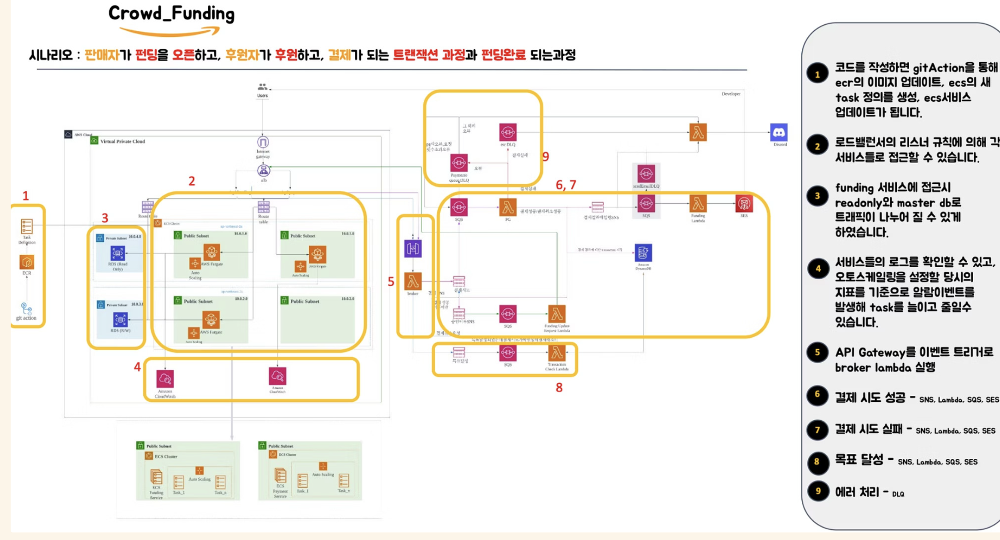

# Crowdfunding — Payment Transaction System (Code States Bootcamp)

A crowdfunding platform built by a 5-person team (Team Luminous) — the full transaction flow from a seller opening a funding campaign to a backer paying and the campaign resolving as successful or failed, on AWS-native infrastructure. My focus was Terraform IaC and the async payment-processing infrastructure.

*Period: 2023.03 – 2023.07 · Team of 5*

---

## Goal

Build a stable, scalable crowdfunding platform on cloud-native AWS infrastructure, with an emphasis on secure payment processing, tracking whether a campaign hits its funding goal, and an async event-driven processing structure that can handle traffic spikes without blocking.

## Architecture

The flow: a broker Lambda behind API Gateway routes incoming requests by publishing to the right SNS topic (payment_attempt, approve_payment, goal_achievement), each topic fans out to an SQS queue, and a purpose-built Lambda consumes each queue — a PG Lambda for the payment gateway integration, a FundingUpdate Lambda that updates campaign funding status, and a TransactionCheck Lambda that verifies transaction state. A SendEmail Lambda, triggered off its own send_email topic, notifies users of the result. Anything that fails processing lands in a DLQ instead of disappearing silently.

**SNS Topics & SQS Queues**
- payment_attempt — payment attempt event
- send_email — email send request
- approve_payment — payment approval processing
- goal_achievement — funding goal reached check
- DLQ — failed message handling

**Lambda Functions**
- PG Lambda — payment gateway integration
- SendEmail Lambda — email notifications
- FundingUpdate Lambda — campaign funding status updates
- TransactionCheck Lambda — transaction verification

## What I built

- Async payment processing logic — the Lambda + SQS chain that moves a payment attempt through validation, gateway integration, and status update without blocking the caller
- Fargate + RDS traffic separation — configured read-only vs. master DB routing so read-heavy funding-list queries don't compete with write traffic on the primary
- SNS topic publishing & SQS routing — wired which events publish to which topic and which queue each Lambda consumes from
- Terraform IaC — built and maintained the infrastructure-as-code for the AWS stack, including the module structure that made the fix below possible

## Troubleshooting: Terraform dependency ordering

**Problem:** terraform apply kept failing intermittently with InvalidSubnetID.NotFound and DependencyViolation — ECS and Lambda resources were being created before the VPC/Subnet/Security Group resources they depended on had actually finished.

**Root cause:**
- VPC/Subnet IDs were hardcoded in places instead of referenced from their source module
- Module output to input wiring was incomplete
- Resources that needed strict ordering (e.g., IAM Role to Lambda) had no explicit depends_on

**Fix:**
- Replaced hardcoded IDs with proper Terraform module references
- Added explicit depends_on for resources with a real ordering requirement
- Refactored VPC/Subnet/Security Group modules into a clean output to input chain so dependent modules always resolve them correctly

**Outcome:** Stable, repeatable terraform apply runs. The bigger lesson was that IaC stability isn't just about writing correct resource blocks — it's about explicit references and dependency declarations that don't leave provisioning order up to chance.

## What I took from it

- Event-driven design & DLQ handling — tracing failed messages through a DLQ instead of assuming "no error" meant "it worked"
- CloudWatch-based diagnosis — using logs to actually pinpoint where in the chain something broke, rather than guessing
- RDS primary-replica routing & container autoscaling — separating read/write traffic and tuning Fargate resources under load
- Terraform IaC discipline — using terraform plan as a real safety check before every apply, and treating module output/input wiring as part of the design, not an afterthought

## Stack

---

## Notes on Attribution

5-person team (Team Luminous). I co-owned AWS infrastructure design and was responsible for Terraform IaC, the Lambda-based async payment flow, and the Fargate/RDS traffic configuration. Weekly stand-ups tracked progress across the team, with Git-based code review and shared documentation (Notion) throughout.
