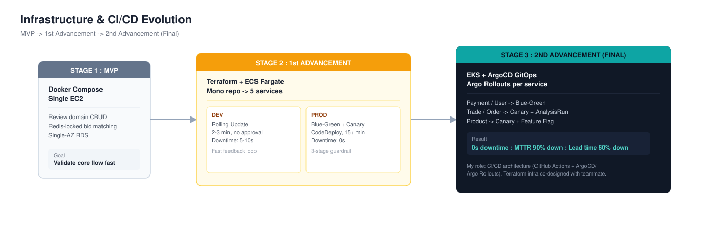
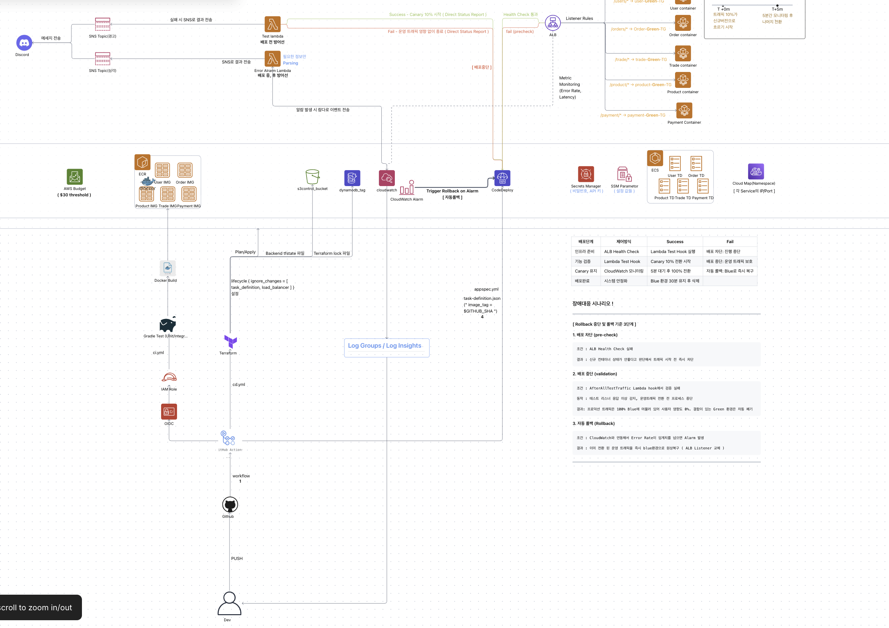
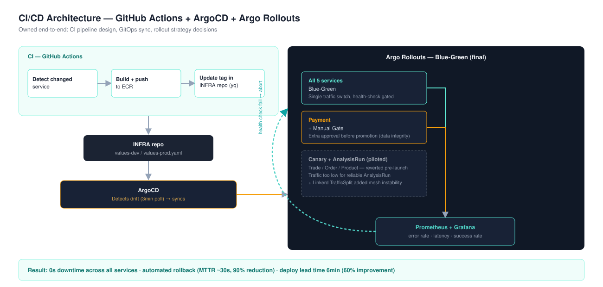
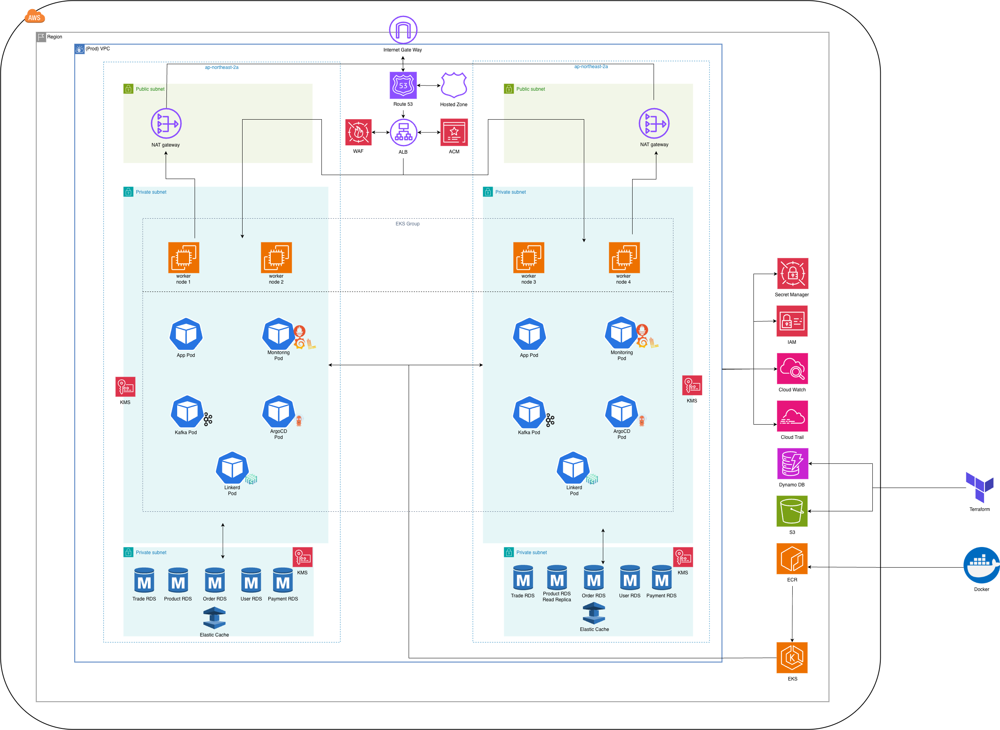
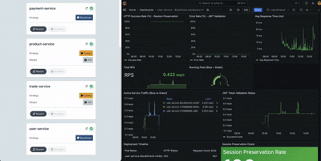
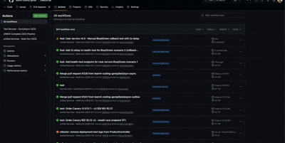
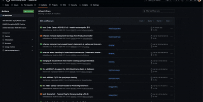
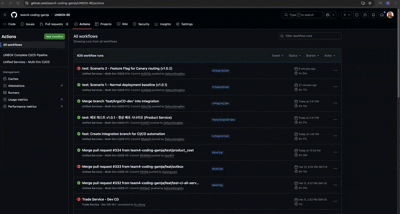
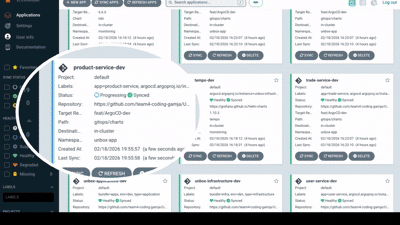
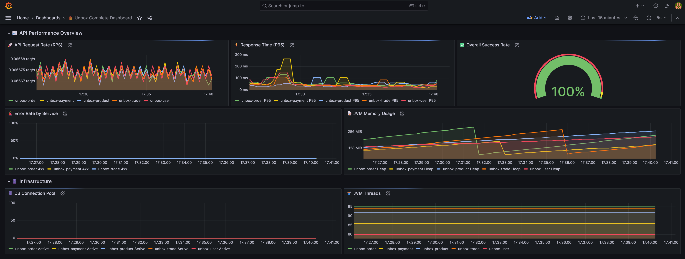

# UNBOX — Infrastructure & CI/CD Evolution: MVP → ECS → EKS GitOps

A C2C resale marketplace backend that evolved through three infrastructure generations — from a single Docker Compose instance to a fully automated, zero-downtime GitOps deployment system on EKS. This document focuses on the infrastructure and CI/CD evolution, which I owned across all three stages.

---

## Evolution at a Glance

| | MVP | 1st Advancement | 2nd Advancement (Final) |
|---|---|---|---|
| Goal | Validate core flow fast | Split into services, automate CI/CD | Zero-downtime, observability-driven ops |
| Compute | 1x EC2 (t3.micro), Docker Compose | ECS Fargate, mono repo to 5 services | EKS (Managed Node Group + Karpenter option) |
| IaC | Manual / minimal Terraform | Terraform, single main.tf | Terraform, modularized (vpc/eks/rds/redis) |
| CI | Basic script | GitHub Actions per service | GitHub Actions (OIDC-based ECR auth) |
| CD | Manual redeploy | Dev: Rolling Update / Prod: Blue-Green + Canary (CodeDeploy) | ArgoCD GitOps + Argo Rollouts, Blue-Green across all 5 services |
| Downtime | N/A (single instance) | Dev: 5-10s / Prod: 0s | 0s across all services, automated rollback |
| My role | Review domain CRUD | CI/CD pipeline design + ECS Terraform provisioning (co-designed with teammate) | CI/CD architecture (GitHub Actions + ArgoCD/Argo Rollouts); infra provisioning co-designed with a teammate who owned Terraform |

---

## Stage 1 — MVP: Prove the Core Flow

Scope: Member auth, product catalog, bidding, order matching (Redis lock for race conditions), inspection/shipping status flow, and reviews with Redis-cached reads. My contribution at this stage was the Review domain CRUD (create/read reviews tied to completed orders, with Redis-cached reads for performance).

Deliberately minimal: single VPC, one public subnet for the app, Docker Compose bundling Spring Boot + Redis on one EC2 instance, single-AZ RDS. The goal was validating the resale-matching logic (lowest-price bid matching under concurrent requests) and getting a working demo fast — not production infrastructure.

---

## Stage 2 — 1st Advancement: Service Split + Dual-Track CI/CD

What changed: Mono repo to 5 independently deployable services on ECS Fargate, each with its own CI/CD pipeline, provisioned via Terraform. Beyond designing the CI/CD pipelines themselves, I co-designed the ECS infrastructure provisioning in Terraform together with a teammate.

Why two different strategies per environment, rather than one strategy everywhere:

| | Dev | Prod |
|---|---|---|
| Strategy | Rolling Update | Blue-Green + Canary |
| Priority | Fast feedback loop | Availability |
| Deploy time | 2-3 min | 15+ min |
| Approval | Fully automated | 2-stage manual (CI approval / CD deploy) |
| Downtime | 5-10s tolerated | 0s |

Prod deployment guardrails — three lines of defense:

**Block** — ALB health check on the Green environment via /actuator/health before any traffic switch.

**Abort** — a Lambda hook runs functional tests (API + DB connectivity) against Green during AfterAllowTestTraffic; on failure it reports straight back to CodeDeploy, independent of CloudWatch.

**Rollback** — after the 10% canary shift, CloudWatch Alarms watch 5xx rate and latency in real time; a threshold breach triggers automatic rollback to Blue.

Blue is kept alive for 30 minutes post-deploy as an immediate recovery target, and every stage (block/abort/rollback) pushes a status message to Discord.

---

## Stage 3 — 2nd Advancement (Final): EKS + GitOps

What changed: ECS to EKS, and the CD tool changed from CodeDeploy to ArgoCD + Argo Rollouts. Infrastructure provisioning (Terraform modules for VPC/EKS/RDS/Redis) was co-designed with a teammate who implemented the Terraform; I owned the CI/CD architecture — GitHub Actions for CI, and the ArgoCD/Argo Rollouts deployment strategy design for CD.

For the full picture of where this pipeline runs — VPC layout, node groups, RDS/Redis, security boundaries — the team's infra diagram is the reference:

### Per-service deployment strategy — decision framework

The plan for this stage was to pilot Canary on a subset of services in Dev while studying the strategy space, then decide the Prod-level approach based on what we learned. I evaluated each service against two questions: "What breaks if this deploy fails?" (blast radius) and "Can old/new versions safely coexist?" (coexistence).

| Service | Failure Impact | Coexistence | Initial Strategy |
|---|---|---|---|
| Payment | Financial data corruption | No - Transaction conflict risk | Blue-Green + Manual Gate |
| User | Platform-wide auth failure | No - JWT incompatible across versions | Blue-Green |
| Trade / Order | Revenue-critical / retryable | Yes - Canary-verifiable | Canary + AnalysisRun (auto-promote on metrics) |
| Product | Traffic bottleneck (90%+ of traffic) | Yes - Canary-verifiable | Canary + Feature Flag |

Payment and User were Blue-Green from the start — JWT incompatibility and payment transaction risk made Canary a non-starter for those two. Trade, Order, and Product were piloted with Canary in Dev.

### Why we moved everything to Blue-Green for Prod

Two problems surfaced during that Dev-environment piloting.

**Traffic volume was too low for AnalysisRun to be trustworthy.** Canary's metric-based auto-promotion assumes production-scale traffic; at a 10% canary weight in Dev, sample sizes were tiny. This showed up directly during Payment testing: a canary run flagged a 14.8% error rate against a 0.5% threshold, but that number came from roughly 30 requests total — nowhere near enough to distinguish a real regression from noise.

**Linkerd's traffic-split layer added its own instability.** Canary routing depended on Linkerd's SMI TrafficSplit resource, which introduced a whole extra failure surface on top of the application layer — pods failing to get their Linkerd identity injected, intermittent 503s tied to the mesh rather than the app itself. Blue-Green sidesteps this entirely: it's a single Service-selector switch, with no traffic-split resource that needs to stay healthy.

Based on what we learned piloting Canary in Dev, we decided Prod should run all 5 services on Blue-Green instead, and moved everything over ahead of the final presentation. Canary earns its complexity when there's enough real traffic volume for its metrics to be statistically meaningful — our environment never had that, so the simpler, more predictable Blue-Green switch was the better call.

This mirrors the project's 3rd goal for the final stage — zero-downtime deployment — alongside observability and efficient scaling as the other two pillars.

A key constraint specific to this domain: the moment traffic shifts to a new version is exactly when concurrent bid/purchase requests are most likely to collide — so zero-downtime deployment only works if the app layer's concurrency control can absorb a traffic spike during the switch. That's why the deployment strategy work was paired with progressively hardening Trade's concurrency handling (DB lock to distributed lock to Redis Lua atomic dequeue to buyer queue + worker threads with backpressure) so deploys stay safe even under simultaneous load.

---

## Results Across the Evolution

| Metric | 1st Advancement (ECS) | 2nd Advancement (EKS) |
|---|---|---|
| Prod downtime | 0s (Blue-Green) | 0s, 100% session preservation (User) |
| Rollback trigger | CloudWatch Alarm (5xx/latency) | Prometheus AnalysisRun during Dev Canary piloting; consolidated to Blue-Green switch for Prod |
| MTTR | Manual rollback ~5 min | Automated rollback ~30s (90% reduction) |
| Deploy lead time | 15 min (prod) | 6 min (60% improvement); Order: 30min to 6.5min (78% down) |
| Blast radius control | Canary 10% (5 min bake) | Blue-Green all-or-nothing switch (Canary piloted in Dev, moved off before Prod due to traffic-volume and Linkerd mesh reliability) |

---

## Demos

| Demo | Shows |
|---|---|
|  | User service Blue-Green — 0s downtime, 100% session preservation |
|  | User service instant abort/rollback (<3s) on detected failure |
|  | Order service Canary promotion (10% to 100%) with automated analysis — piloted in Dev |
|  | Product service baseline Canary deployment — piloted in Dev |
|  | Product service Feature Flag — forced routing via header |

## Observability

Prometheus + Grafana for metrics, Loki for centralized logs, Tempo for distributed tracing (LGTM stack) — this is what the AnalysisRun gates read from during the Dev Canary piloting described above.

---

## Stack

---

## Notes on Attribution

This was a 5-person team project. At MVP stage I built the Review domain CRUD. From the 1st Advancement onward I owned CI/CD design — the GitHub Actions pipelines, the dual-track Dev/Prod deployment strategy on ECS, and the ArgoCD + Argo Rollouts GitOps migration and per-service strategy design on EKS, including the decision to move Prod from a mixed Canary/Blue-Green plan to Blue-Green across all services — and co-designed the underlying Terraform infrastructure provisioning (ECS in the 1st Advancement, EKS in the final stage) together with a teammate who implemented the Terraform modules. Application-layer work (concurrency control, caching, event-driven patterns) was owned by other team members and is documented in their respective sections of the repo.
